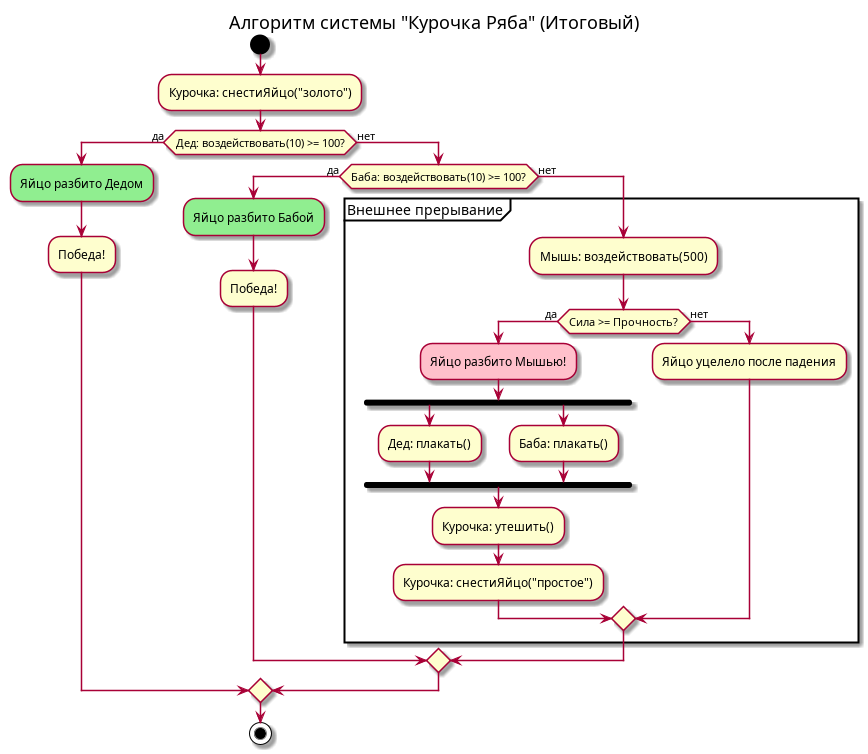
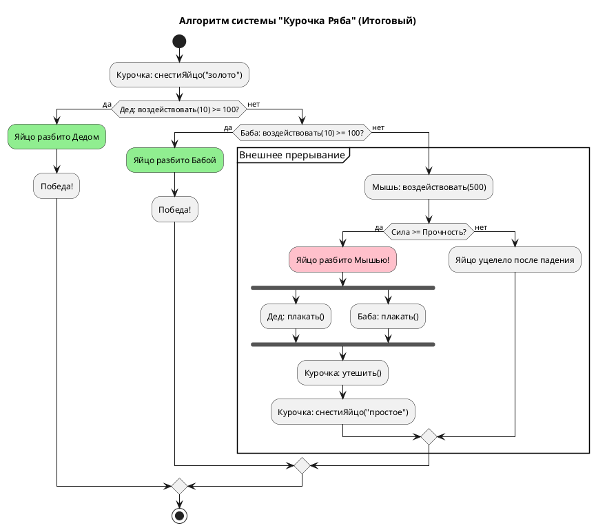

# Activity Diagram: Алгоритм системы "Курочка Ряба"

## Обзор

Эта диаграмма активности показывает алгоритм работы системы "Курочка Ряба".

## Описание потока

### Шаг 1: Создание яйца
- Курочка creates a golden egg (ЗолотоеЯйцо) with прочность = 100

### Шаг 2: Попытка Деда
- Дед attempts to break the egg with сила = 10
- Check: воздействовать(10) >= 100?
- **No** - Egg remains intact

### Шаг 3: Попытка Бабы
- Баба attempts to break the egg with сила = 10
- Check: воздействовать(10) >= 100?
- **No** - Egg remains intact

### Шаг 4: Вмешательство Мыши (Внешнее прерывание)
- Мышь intervenes with сила = 500
- Check: Сила >= Прочность?
- **Yes** - Egg is broken by Mouse!
  - Дед starts crying
  - Баба starts crying
  - Курочка consoles them
  - Курочка creates a simple egg (ПростоеЯйцо)

### Шаг 5: Яйцо выживает
- If сила < прочность, the egg survives the fall

## Точки принятия решений

| Условие | Результат |
|-----------|--------|
| Дед: воздействовать(10) >= 100 | No (10 < 100) |
| Баба: воздействовать(10) >= 100 | No (10 < 100) |
| Мышь: воздействовать(500) >= 100 | Yes (500 >= 100) |

## Диаграмма

