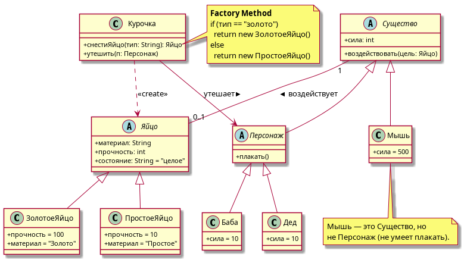
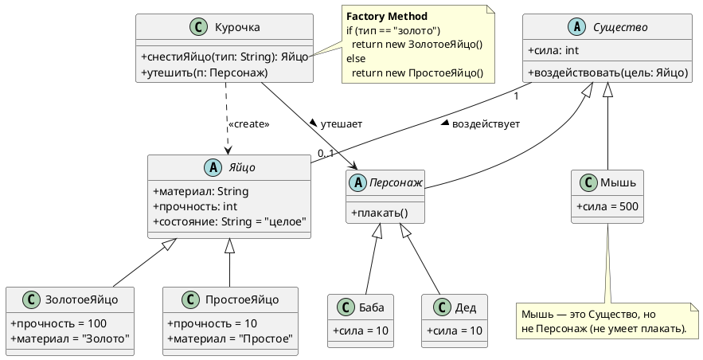

# Class Diagram: Курочка Ряба

## Обзор

Эта диаграмма классов показывает объектно-ориентированную структуру системы сказки "Курочка Ряба".

## Иерархия классов

### Иерархия существ

| Class | Type | Attributes | Methods |
|-------|------|------------|---------|
| Существо | Abstract | + сила: int | + воздействовать(цель: Яйцо) |
| Персонаж | Abstract | extends Существо | + плакать() |
| Дед | Concrete | + сила = 10 | extends Персонаж |
| Баба | Concrete | + сила = 10 | extends Персонаж |
| Мышь | Concrete | + сила = 500 | extends Существо |

### Иерархия продуктов

| Class | Type | Attributes | Methods |
|-------|------|------------|---------|
| Яйцо | Abstract | + материал: String, + прочность: int, + состояние: String = "целое" | - |
| ЗолотоеЯйцо | Concrete | + прочность = 100, + материал = "Золото" | extends Яйцо |
| ПростоеЯйцо | Concrete | + прочность = 10, + материал = "Простое" | extends Яйцо |

### Фабрика

| Класс | Тип | Методы |
|-------|------|---------|
| Курочка | Конкретный | + снестиЯйцо(тип: String): Яйцо, + утешить(п: Персонаж) |

## Связи

- **Курочка ..> Яйцо**: Creates (<<create>>)
- **Курочка --> Персонаж**: Утешает
- **Существо "1" -- "0..1" Яйцо**: Воздействует

## Шаблоны проектирования

### Фабричный метод
```java
public Яйцо снестиЯйцо(тип: String) {
    if (тип == "золото") 
        return new ЗолотоеЯйцо()
    else 
        return new ПростоеЯйцо()
}
```

## Заметки

- **Мышь** — это Существо, но не Персонаж (не может плакать)
- Дед и Баба имеют сила = 10, что меньше прочность = 100 у ЗолотоеЯйцо
- Мышь имеет сила = 500, что больше прочность = 100 у ЗолотоеЯйцо

## Диаграмма




