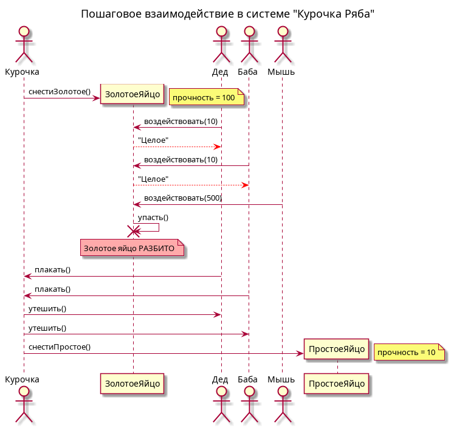
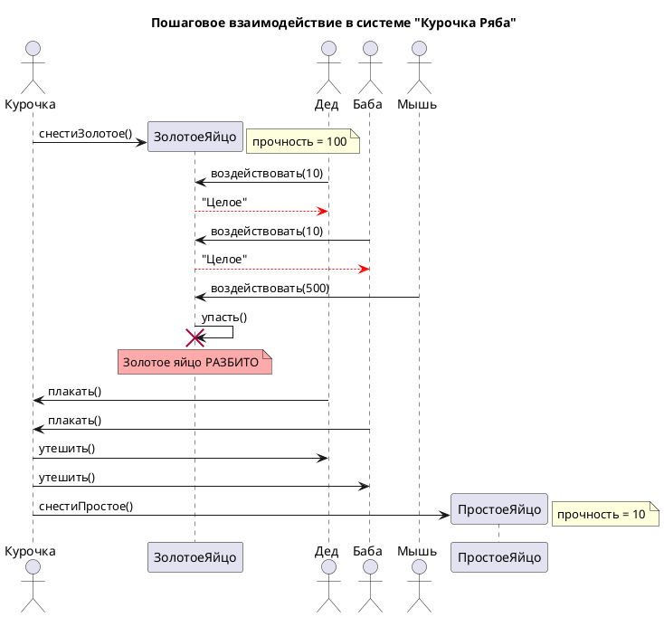

# Sequence Diagram: Взаимодействие в системе "Курочка Ряба"

## Обзор

Эта диаграмма последовательности показывает пошаговое взаимодействие между актерами и объектами в системе "Курочка Ряба".

## Актеры и участники

| Актер/Участник | Описание |
|-------------------|-------------|
| Курочка (C) | The chicken that lays eggs |
| ЗолотоеЯйцо (GE) | Golden egg with прочность = 100 |
| Дед (D) | Grandpa |
| Баба (B) | Grandma |
| Мышь (M) | Mouse |
| ПростоеЯйцо (SE) | Simple egg with прочность = 10 |

## Interaction Steps

### Шаг 1: Создание золотого яйца
- Курочка creates ЗолотоеЯйцо
- Note: прочность = 100

### Шаг 2: Попытки пользователей
- Дед attempts to affect the egg with сила = 10
- ЗолотоеЯйцо responds: "Целое" (Intact)
- Баба attempts to affect the egg with сила = 10
- ЗолотоеЯйцо responds: "Целое" (Intact)

### Шаг 3: Вмешательство Мыши
- Мышь attempts to affect the egg with сила = 500
- ЗолотоеЯйцо falls and is destroyed
- Note: Золотое яйцо РАЗБИТО (Golden egg is BROKEN)

### Шаг 4: Реакции персонажей
- Дед cries to Курочка
- Баба cries to Курочка

### Шаг 5: Финал
- Курочка consoles Дед
- Курочка consoles Баба
- Курочка creates ПростоеЯйцо
- Note: прочность = 10

## Ключевые наблюдения

1. Дед и Баба не могут разбить золотое яйцо (10 < 100)
2. Мышь может разбить золотое яйцо (500 >= 100)
3. Курочка выступает как Фабрика, создавая новые яйца
4. После того как золотое яйцо разбито, Курочка создаёт простое яйцо в качестве замены

## Диаграмма

