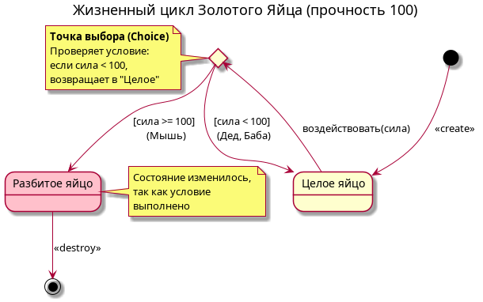
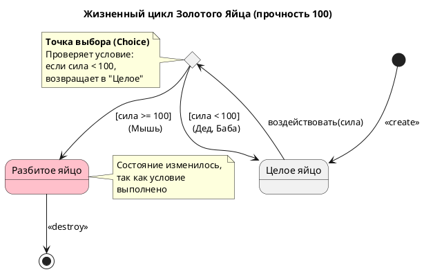

# State Diagram: Жизненный цикл Золотого Яйца

## Обзор

Эта диаграмма состояний показывает жизненный цикл Золотого Яйца (ЗолотоеЯйцо) с прочность = 100.

## Состояния

| Состояние | Описание | Цвет фона |
|-------|-------------|------------------|
| Целое | целое яйцо (Intact egg) | Default |
| Разбитое | разбитое яйцо (Broken egg) | Pink |

## Переходы состояний

### Начальное состояние
- [*] --> Целое : <<create>>

### Переход: воздействовать(сила)
- Из Целое в точку выбора (c)

### Логика точки выбора
| Условие | Следующее состояние |
|-----------|------------|
| сила < 100 | Целое (Дед, Баба) |
| сила >= 100 | Разбитое (Мышь) |

### Конечное состояние
- Разбитое --> [*] : <<destroy>>

## Ключевые моменты

- **Точка выбора (c)**: Проверяет условие
  - Если сила < 100, возвращает в "Целое"
  - Если сила >= 100, переходит в "Разбитое"

- Дед и Баба имеют сила = 10, что меньше 100, поэтому яйцо остаётся целым
- Мышь имеет сила = 500, что больше 100, поэтому яйцо становится разбитым

## Диаграмма

