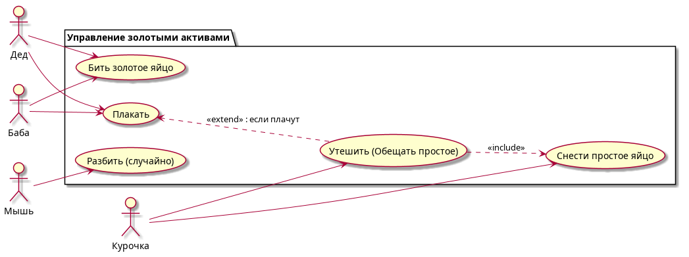

# Use Case Diagram: Управление золотыми активами

## Актеры

| Актер | Описание |
|-------|-------------|
| Дед | Дедушка |
| Баба | Бабушка |
| Мышь | Мышка |
| Курочка | Курочка |

## Варианты использования

### Пакет: Управление золотыми активами

| Вариант использования | Описание |
|----------|-------------|
| Бить золотое яйцо | Бить золотое яйцо |
| Разбить (случайно) | Разбить яйцо хвостом (случайно) |
| Плакать | Плакать |
| Утешить (Обещать простое) | Утешить и обещать простое яйцо |
| Снести простое яйцо | Снести простое яйцо |

## Связи

### Актер к варианту использования

- **Дед** и **Баба** выполняют: Бить золотое яйцо
- **Мышь** выполняет: Разбить (случайно)
- **Дед** и **Баба** выполняют: Плакать
- **Курочка** выполняет: Утешить (Обещать простое)
- **Курочка** выполняет: Снести простое яйцо

### Отношения Extend/Include

- **Плакать** ←← **Утешить** (<<extend>>): если плачут
- **Утешить** →→ **Снести простое яйцо** (<<include>>)

## Диаграмма



```
@startuml
left to right direction

actor "Дед" as Grandpa
actor "Баба" as Grandma
actor "Мышь" as Mouse
actor "Курочка" as Chicken

package "Управление золотыми активами" {
  usecase "Бить золотое яйцо" as Hit
  usecase "Разбить (случайно)" as BreakByTail
  usecase "Плакать" as Cry
  usecase "Утешить (Обещать простое)" as Comfort
  usecase "Снести простое яйцо" as SpawnSimple
}

' Дед и Баба бьют яйцо (действие)
Grandpa --> Hit
Grandma --> Hit

' Мышь разбивает (действие)
Mouse --> BreakByTail

' Дед и Баба ПЛАЧУТ (линии ведут к ним)
Grandpa --> Cry
Grandma --> Cry

' Курочка УТЕШАЕТ и СНОСИТ (линии к ней)
Chicken --> Comfort
Chicken --> SpawnSimple

' Зависимости внутри системы
Cry <.. Comfort : <<extend>> : если плачут
Comfort ..> SpawnSimple : <<include>>
@enduml
```

## Описание

Эта диаграмма вариантов использования иллюстрирует сценарий сказки, связанный с историей "Курочка Ряба":

1. **Дед** и **Баба** пытаются **разбить** золотое яйцо
2. **Мышь** случайно **разбивает** яйцо хвостом
3. **Дед** и **Баба** начинают **плакать** над разбитым золотым яйцом
4. **Курочка** **утешает** их и обещает снести простое яйцо
5. **Курочка** затем **несёт** простое яйцо

Связь показывает, что плач вызывает действие утешения (extend), а утешение включает действие по снесению простого яйца (include).
